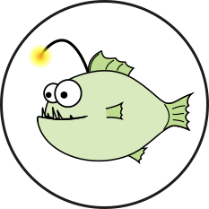

# Anglerfish
[](https://github.com/remiolsen/anglerfish/actions)
[](https://pypi.python.org/pypi/bio-anglerfish/)
[](https://anaconda.org/bioconda/anglerfish)
[](https://hub.docker.com/r/remiolsen/anglerfish/)


## Introduction

Anglerfish is a tool designed to demultiplex Illumina libraries sequenced on Oxford Nanopore
flowcells. The primary purpose for this would be to do QC, i.e. to check pool balancing, assess
contamination, library insert sizes and so on.

For more information on how this can be used, please see this [poster](docs/AGBT_poster_20200214.pdf).

## Installation

### Requirements

* Python3 (3.7)

Python modules:

* biopython v. 1.70
* python-levenshtein v. 0.12.0
* numpy v. 1.19.2

Software:

* minimap2 v. 2.20

### From PyPi

```
pip install bio-anglerfish
```

### From Bioconda

```
conda install -c bioconda multiqc
```

### Manually with Conda

First [install miniconda](https://docs.conda.io/en/latest/miniconda.html), then:

```
git clone https://github.com/remiolsen/anglerfish.git
cd anglerfish
# Create a the anglerfish conda environment
conda env create -f environment.yml
# Install anglerfish
pip install -e .
```

### Development version

```
pip install --upgrade --force-reinstall git+https://github.com/remiolsen/anglerfish.git
```

## Usage

Anglerfish requires two files to run.

  * A basecalled FASTQ file from for instance Guppy (`/path/to/ONTreads.fastq.gz`)
  * A samplesheet containing the sample names and indices expected to be found in the sequencing run. (`/path/to/samples.csv`)

Example of a samplesheet file:

```
P12864_201,truseq_dual,TAATGCGC-CAGGACGT,/path/to/ONTreads.fastq.gz
P12864_202,truseq_dual,TAATGCGC-GTACTGAC,/path/to/ONTreads.fastq.gz
P9712_101, truseq_dual,ATTACTCG-TATAGCCT,/path/to/ONTreads.fastq.gz
P9712_102, truseq_dual,ATTACTCG-ATAGAGGC,/path/to/ONTreads.fastq.gz
P9712_103, truseq_dual,ATTACTCG-CCTATCCT,/path/to/ONTreads.fastq.gz
P9712_104, truseq_dual,ATTACTCG-GGCTCTGA,/path/to/ONTreads.fastq.gz
P9712_105, truseq_dual,ATTACTCG-AGGCGAAG,/path/to/ONTreads.fastq.gz
P9712_106, truseq_dual,ATTACTCG-TAATCTTA,/path/to/ONTreads.fastq.gz
```

Or using single index:

```
P12345_101,truseq,CAGGACGT,/path/to/ONTreads.fastq.gz
```

Then run:

```
anglerfish -s /path/to/samples.csv
```

### Optional

```
--out_fastq OUT_FASTQ, -o OUT_FASTQ
                      Analysis output folder (default: Current dir)
--samplesheet SAMPLESHEET, -s SAMPLESHEET
                      CSV formatted list of samples and barcodes
--threads THREADS, -t THREADS
                      Number of threads to use (default: 4)
--skip_demux, -c      Only do BC counting and not demuxing
--max-distance MAX_DISTANCE, -m MAX_DISTANCE
                      Manually set maximum edit distance for BC matching, automatically set this is set to either 1 or 2
```

### Output files

In folder `anglerfish_????_??_??_?????/`

* `*.fastq.gz` Demultuplexed reads (if any)
* `anglerfish_stats.txt` Barcode statistics from anglerfish run
* `anglerfish_stats.json` Machine readable anglerfish statistics


## Credits

The Anglerfish code was written by [@remiolsen](https://github.com/remiolsen) but it would not exist without the contributions of [@FranBonath](https://github.com/FranBonath), [@taborsak](https://github.com/taborsak), [@ssjunnebo](https://github.com/ssjunnebo) and Carl Rubin.
Also, the [Anglerfish logo](docs/Anglerfish_logo.svg) was designed by [@FranBonath](https://github.com/FranBonath).

<p align="center">
  
</p>
